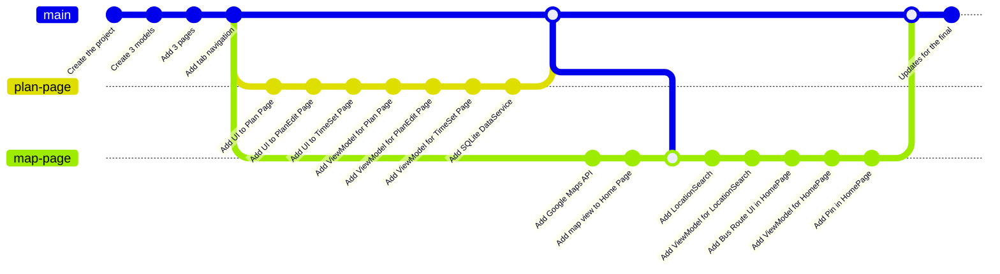

# SchedBus
## Introduction
SchedBus makes it easier to find the best bus routes to your workplaces, schools, meetings, or any place before the desired time. Based on the arrival time set for each destination, SchedBus will send a notification of the next coming bus which makes sure you arrive in time. Unlike other maps and bus applications on the market, it also allows you to add and customize more than one planned time for your favorite destinations.
## Mockup

## How it works
- When you have one or more of your planned times occur today, SchedBus will display the plans along with the number of trips available on the Home Page.
- By tapping on a plan on the Home Page or Plan Page, it will direct you to the Trip List Page which displays all available trips based on your arrival time. You can choose to see the next trip coming by selecting the Leave Now button in the above bar.
- SchedBus can show details of a selected trip including steps to take, bus arrival time, bus number, bus stop, and estimated arrival time at destination.
## Components
| **Name** | **Integrated** |
| --- | --- |
| [CommunityToolkit.Mvvm](https://www.nuget.org/packages/CommunityToolkit.Mvvm/8.2.2?_src=template) | ✅
| [Microsoft.Maui.Controls.Maps](https://www.nuget.org/packages/Microsoft.Maui.Controls.Maps/8.0.3?_src=template) | ✅
| [Google Maps APIs](https://developers.google.com/maps) | ✅
| [SQLiteNetExtensions.Async](https://www.nuget.org/packages/SQLiteNetExtensions.Async/) | ✅
| [SkiaSharp.Extended.UI.Maui](https://www.nuget.org/packages/SkiaSharp.Extended.UI.Maui/2.0.0-preview.86?_src=template) | ✅
## Not Implemented
| **Name** | **Description** | **Reseason** |
| --- | --- | --- |
| Notification | Minimizes the chances of missing buses by sending notifications of saved plans | Required to learn more documentation & Time constraints |
| Display today's time in each plan | Shows the today's set time if set or show the next set time | Finding the effcient way to get the set time |
## Branch Flow

